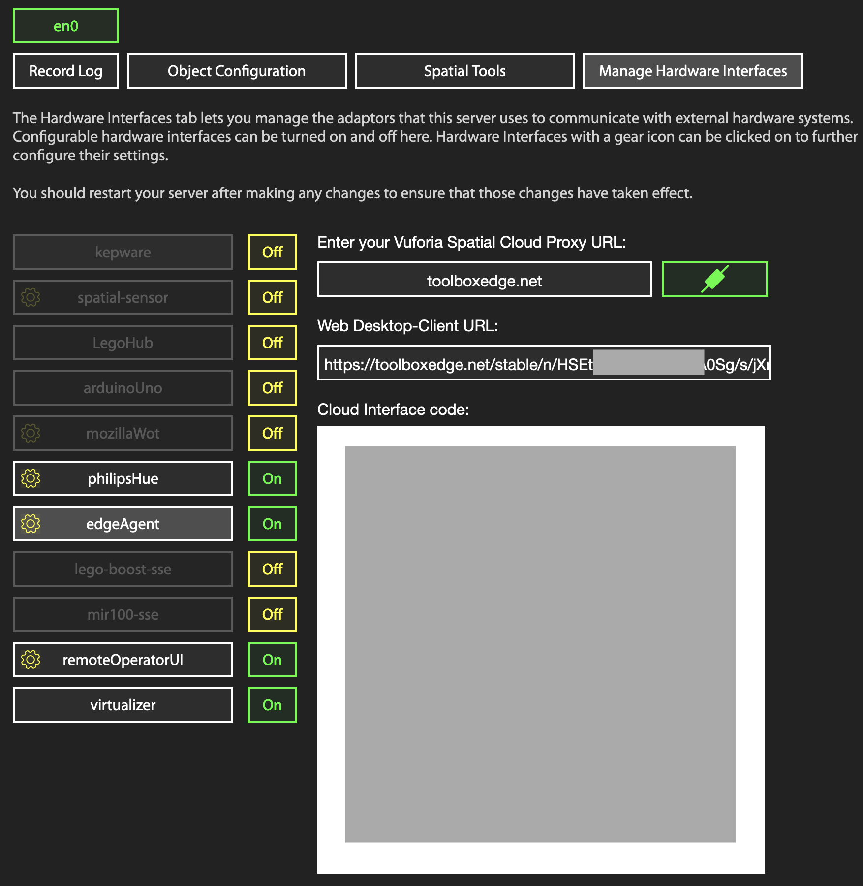

# Toolbox Edge Agent Addon
Clone into your vuforia-spatial-edge-server/addons directory, run `npm ci`,
then open the Hardware Interfaces section on your server's :8080 page to enable
and configure the addon.

If everything's working it will look like this:

