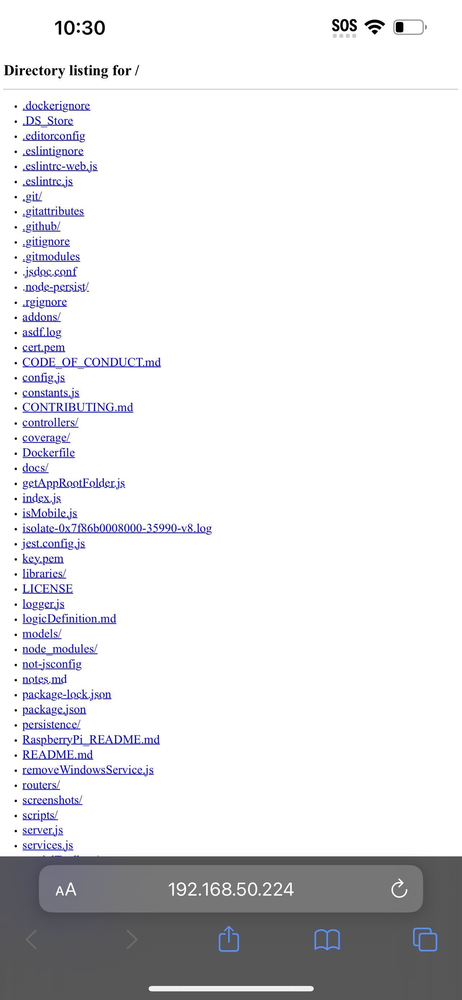
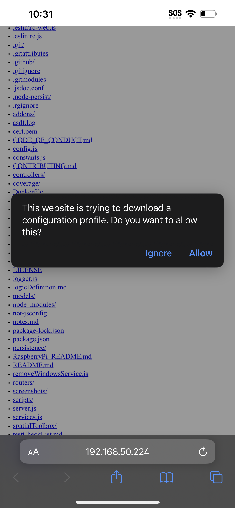
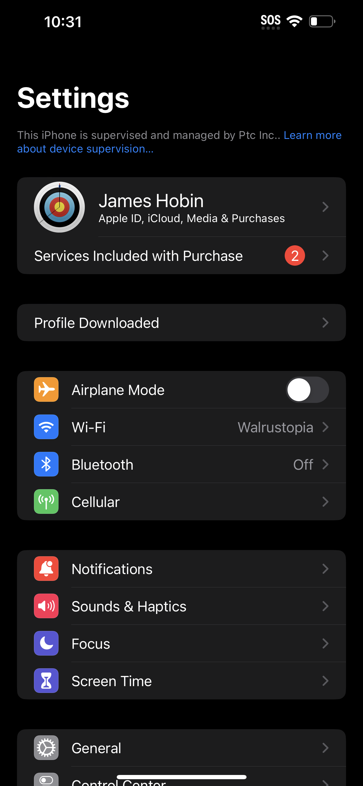
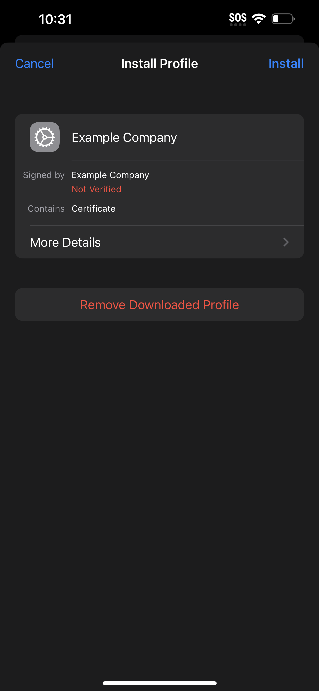

The overall process to trusting a local edge server's self-signed certificates
is to download the cert onto the phone then trust the "Profile" this cert
provides in the phone's settings.

### Download cert.pem onto phone
We need to get the file `cert.pem` onto the phone. One such tool is python's built-in http server:

Next, navigate to http://your-edge-server-ip-address:8000/ to see a listing of
all files in this directory and download cert.pem from the list.

The page will prompt you if you trust this configuration profile. Accept this prompt and open the Settings app to finish trusting the profile.

### Trust configuration profile in Settings

In the Settings app there will be a helpful shortcut "Profile Downloaded" to
navigate directly to trusting the newly downloaded profile.

Tap this shortcut to move onto trusting the profile. Press "Install" on this
next screen and enter your passcode to finish the trusting process.

With this entire process complete, you should now see the Configuration Profile
reflected in the Settings - VPN and Device Management list of profiles.

